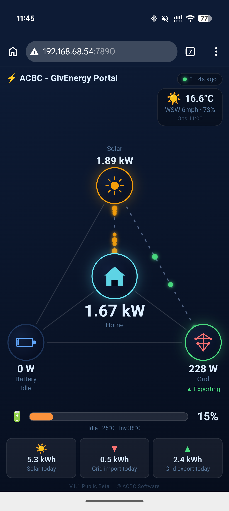

# ACBC GivEnergy Dashboard

A local, self-hosted energy monitoring dashboard for GivEnergy inverters.  
Connects directly to your inverter via Modbus TCP — no cloud dependency, no subscription, no data leaving your home.



---

## Features

- Live power flows — solar, home, battery and grid with animated particle visualisation
- Battery state of charge with temperature and voltage
- Daily/weekly/monthly/yearly history charts
- Met Office weather widget (optional)
- Progressive Web App — installs on iPhone and Android home screens
- Settings page protected by admin password
- Optional remote access via Cloudflare Tunnel (see below)

---

## Requirements

| | Minimum |
|---|---|
| Python | 3.9 or later |
| GivEnergy inverter | Any model with Modbus TCP enabled on port 8899 |
| Network | Installer machine on same LAN as the inverter |

---

## Installation

### Raspberry Pi (recommended — runs 24/7 on ~3W)

A Raspberry Pi 3B+ or later running **Raspberry Pi OS Lite (64-bit, Bookworm)** is ideal.

1. Flash the OS image using [Raspberry Pi Imager](https://www.raspberrypi.com/software/)  
   — enable SSH and set a hostname/username during the flash process.

2. Copy the project files to the Pi (or clone the repo):
   ```bash
   scp -r givenergy-dashboard/ pi@raspberrypi.local:~/
   ```

3. SSH in and run the installer:
   ```bash
   ssh pi@raspberrypi.local
   cd ~/givenergy-dashboard
   bash setup.sh
   ```

4. Edit the configuration file when prompted and set your inverter's IP address.

5. The dashboard starts automatically and survives reboots.

**Useful commands after install:**
```bash
sudo systemctl status givenergy-dashboard    # check it's running
sudo journalctl -u givenergy-dashboard -f    # live log output
sudo systemctl restart givenergy-dashboard   # restart after config changes
```

---

### Linux (Ubuntu / Debian)

Same as Raspberry Pi above — `setup.sh` works on any Debian-based system.

```bash
cd givenergy-dashboard
bash setup.sh
```

The script installs Python dependencies, creates a virtual environment in  
`/opt/givenergy-dashboard/venv`, generates the PWA icons, and registers a  
systemd service that starts on boot.

---

### Windows

#### Option A — Installer (recommended)

1. Install [Python 3.11+](https://python.org/downloads/) — **tick "Add Python to PATH"** during setup.
2. Download and run **`GivEnergy-Dashboard-Setup-v1.1.exe`**.
3. The installer will:
   - Create a Python virtual environment
   - Install all required packages
   - Generate app icons
   - Create Start Menu shortcuts
   - Offer to open `config.ini` for editing
4. Set your inverter IP in `config.ini`, then use **Start Dashboard** from the Start Menu.

> To compile the installer yourself: install [Inno Setup 6](https://jrsoftware.org/isinfo.php), open `installer.iss` and press `Ctrl+F9`.

#### Option B — Manual setup

```bat
REM From a command prompt in the project folder:
python -m venv venv
venv\Scripts\pip install flask givenergy-modbus Pillow pyopenssl
venv\Scripts\python generate_icons.py
copy config.ini.example config.ini
REM Edit config.ini, then:
start_dashboard.bat
```

---

## Configuration

Edit `config.ini` before first launch. A fully commented template is provided in `config.ini.example`.

### Inverter settings

```ini
[inverter]
ip             = 192.168.1.100   ; your inverter's LAN IP
port           = 8899            ; Modbus TCP port (default, don't change)
num_batteries  = 1               ; number of battery units
mode           = auto            ; auto | poll | listen
```

Find your inverter's IP in your router's DHCP client list. The inverter is usually named something like `GivEnergy` or `SA-XXXX`.

**Connection mode** — leave on `auto` and it works it out for you:
- `poll` — actively reads the inverter (Gen2 and most models)
- `listen` — passively decodes the broadcast stream (Gen3 / HV hybrid inverters)
- `auto` — tries `poll` first; if the inverter won't answer but is broadcasting, switches to `listen` (recommended)

### Server settings

```ini
[server]
poll_interval        = 10    ; seconds between inverter polls (min 5)
web_port             = 7890  ; dashboard port
data_retention_days  = 730   ; history kept in database (days)
```

### Weather (optional)

Displays live Met Office observations in the dashboard header.

1. Register free at [datahub.metoffice.gov.uk](https://datahub.metoffice.gov.uk)
2. Subscribe to the **Observation Land** (CDP) free tier
3. Call the nearest-station endpoint to find your geohash:
   ```
   GET https://data.hub.api.metoffice.gov.uk/observation-land/1/nearest?lat=XX.XX&lon=-X.XX
   ```
4. Add the values to `config.ini`:
   ```ini
   [weather]
   met_api_key = your-api-key-here
   geohash     = gcxxxx
   ```

Or configure it via the ⚡ Settings screen in the dashboard.

---

## Admin password

The Settings screen (tap the ⚡ bolt icon) is protected by a password.  
**Default password: `password`** — change it on first use.

Passwords are stored as a SHA-256 hash in `config.ini`. If you lose the password, set `password_hash` to the default value above.

---

## Upgrading to a new version

Upgrades **never touch your settings or history**. Your `config.ini` (settings, weather key, admin password) and `history.db` (all logged data) are always preserved, and any new database columns/tables are added automatically on first run of the new version.

### Windows

Download and run the new installer. It detects the existing install, upgrades it in place, and keeps your `config.ini` and `history.db` untouched. (It will stop the dashboard first if it's running — just start it again from the Start Menu afterwards.)

### Linux / Raspberry Pi — fast update

Download the new project zip, unzip it, and from inside the folder run:

```bash
bash update.sh
```

This stops the service, **backs up** your `config.ini` and `history.db` to `/opt/givenergy-dashboard/backups/<timestamp>/`, copies only the application files (never your data), updates Python packages, and restarts. Your settings and history are kept.

> Re-running `bash setup.sh` is also safe — it preserves your config and database — but `update.sh` is faster as it doesn't rebuild the virtual environment.

### What's preserved

| File | Contents | Kept on upgrade? |
|---|---|---|
| `config.ini` | Inverter IP, ports, weather key, admin password | ✅ Always |
| `history.db` | All logged readings + activity log | ✅ Always |
| New settings added in a release | — | Default values apply until you change them |

---

## Accessing on your phone

Open `http://<your-server-ip>:7890` in Safari (iPhone) or Chrome (Android).

**Install as a home screen app:**
- **iPhone**: Share → Add to Home Screen
- **Android**: Chrome menu (⋮) → Add to Home Screen

The app opens full-screen with no browser chrome once installed.

---

## Remote access (optional)

To reach the dashboard securely from outside your home network without port forwarding, [Cloudflare Tunnel](https://developers.cloudflare.com/cloudflare-one/connections/connect-networks/) is the recommended approach.

**Requirements:** a free Cloudflare account and a domain name.

**High-level steps:**
1. Install `cloudflared` on the machine running the dashboard
2. Authenticate: `cloudflared tunnel login`
3. Create a named tunnel: `cloudflared tunnel create my-dashboard`
4. Configure the tunnel to route `yourdomain.com` → `http://localhost:7890`
5. Create a DNS CNAME record via: `cloudflared tunnel route dns my-dashboard yourdomain.com`
6. Run `cloudflared` as a service

Cloudflare also offers **Cloudflare Access** (free) to put a login gate in front of the URL so only authorised email addresses can reach it.

Full Cloudflare documentation: [developers.cloudflare.com/cloudflare-one](https://developers.cloudflare.com/cloudflare-one/)

---

## Troubleshooting

**Dashboard shows "Connecting…" and never loads**  
→ Check the inverter IP in `config.ini` and that the server can ping it.  
→ Ensure port 8899 is reachable: `telnet <inverter-ip> 8899`

**"No module named flask" on Windows**  
→ Make sure you're running `start_dashboard.bat` (which uses the venv Python), not the system Python.

**Weather widget not showing**  
→ Check that both `met_api_key` and `geohash` are set in `config.ini` or via Settings.

**History data looks wrong for today**  
→ The inverter resets its daily counters at midnight. Data for the current day accumulates through the day and is correct by end of day.

**Port 7890 already in use**  
→ Change `web_port` in `config.ini` to another port (e.g. 7891).

---

## Licence

MIT Licence — see `LICENCE` file.  
© ACBC Software
